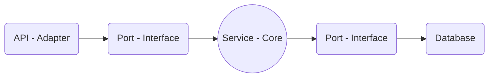

### Hexagonal Architecture Example

[](https://opensource.org/licenses/MIT)  []() []() []() [](https://ko-fi.com/jeanjmichel)


Hi! This repository is a simple example of how works a software (developed in C#) using a hexagonal architecture.

In my blog (just in Portuguese) there is a mode deep explication, but to illustrate this matter here goes a short explication.

Imagine that builds something, a software or a sandcastle in the beach, bring to us a need to thing in future problems and find the best way to do something that, minimally, stay up when we need.

A build, a house or a software needs a solid base, and these base drives all the way that we will construct what we need.

Hexagonal architecture shows us how encapsulate our models and business rules in a strength **Core**, that can be tested isolated and defines in a unique place how the model can be manipulated.
Around the core we have the contracts that define what who want to use the models must implements for it, this layer is called **Ports**.

And finally using these ports we have the **Adapters**. Who make the in and out flow in the process.

Complicated? _**No**_!

A Core package can include:

- A model, like the UserModel of this project. That is a simple POCO (Plain Old Class Object), nothing more than fields and getters and setters.
- A service, like our UserService in this project. This class implements the business rules to manipulate the model.

In Ports we define the contracts (interfaces) that can be signed (implemented) for who want to manipulate the models. Example: IUserRepository.

Ok, to Adapters rest two possibilities, be an inbound or an outbound adapter. Which is the same thing as saying it's ways to access the models using the Ports to send data or using these same interfaces layer to send model data to another place, like a database.

Something like it:



Is it clearer?

This project try show these with a simple example.

To run the project:

Clone these repository into a folder in your local machine:

```git clone https://github.com/jeanjmichel/hexagonalarchitectureexample.git```

Run the project:

```dotnet run```

Now you can access the Swegger documentation in your browser by the URL:

[http://localhost:5272/docs/index.html](http://localhost:5272/docs/index.html)

Or use CURL in the command tool:

|OS                                   |Command                                                                                                                                                 |
|-------------------------------------|--------------------------------------------------------------------------------------------------------------------------------------------------------|
|Windows using PowerShell             |Invoke-WebRequest -Uri "http://localhost:5272/api/users" -Method Post -Headers @{"Content-Type"="application/json"} -Body '{ "Name": "Jean J. Michel"}' |
|Windows using PowerShell             |Invoke-RestMethod -Uri "http://localhost:5272/api/users" -Method Post -Headers @{"Content-Type"="application/json"} -Body '{ "Name": "Jean J. Michel"}' |
|Linux/macOS (or Git Bash on Windows) |curl -X POST http://localhost:5272/api/users -H "Content-Type: application/json" -d '{ "Name": "Jean J. Michel"}'                                       |

Questions? Call me here or in another social network.